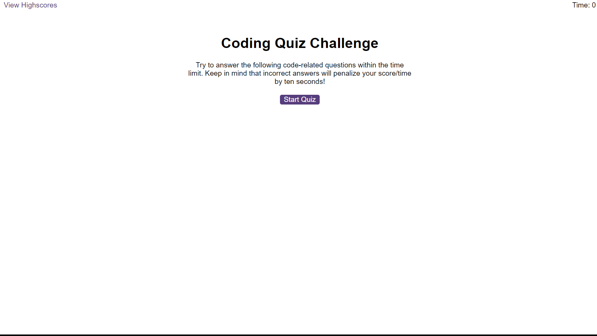

# quiz-wiz-js

Boost your JavaScript skills with engaging coding quizzes

## Description

The quiz wiz jz is an interactive quiz platform designed to test and enhance your knowledge in [specific field/subject/topic]. With a user-friendly interface, this quiz application offers a curated set of questions spanning various topics, providing an engaging and educational experience for users.

## Installation

No installation needed

[Click here to see live copy of the site](https://lav3ll.github.io/quiz-wiz-js)

[Link to quiz wiz js repo](https://github.com/lav3ll/quiz-wiz-js)

## Usage

**Website Overview:**

Step into the realm of knowledge and fun with our interactive quiz platform! Test your expertise across various topics and challenge your intellect.

**Key Features:**

# Quiz Experience: Engage in an exciting quiz experience with a series of thought-provoking questions.

# Timer Functionality: A countdown timer adds an element of challenge, keeping the quiz engaging and competitive.

# Multiple-Choice Format: Answer questions by choosing from multiple options, each designed to test your knowledge.

# Immediate Feedback: Receive instant feedback on your answers, with correct solutions provided.

**Goals and Results:**

Assist in providing the user quick feedback on their knowledge of javascript.

## Credits

Skills For Life
Ed X

## License

MIT License
